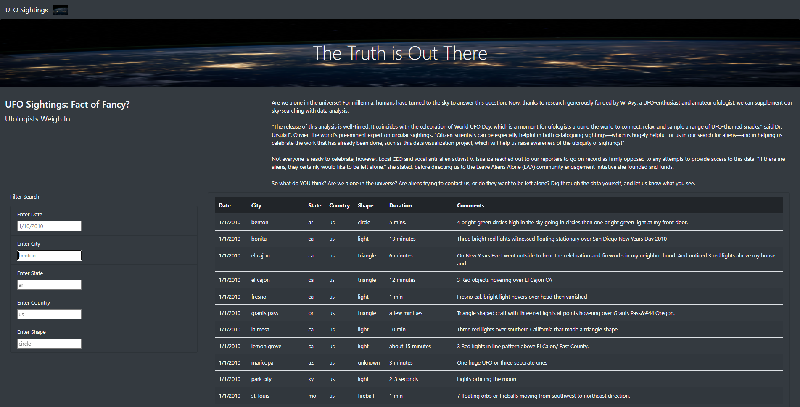
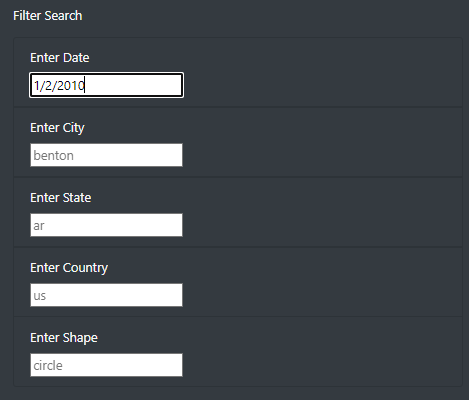
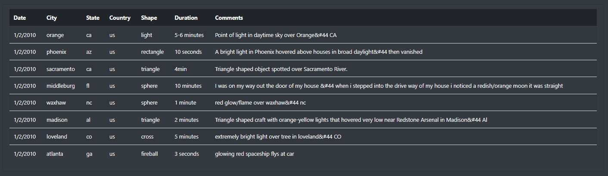

# UFOs

## Overview of Project

In this project we created an interactive web application that collected UFO sighting data into a table and allowed the data to be filtered using different parameters. 

### Purpose

In this project I used HTML to design a web application. I then styled the sheet using bootstrap formatting and CSS. Then I used Javascript to turn a Javascript datafile into a table that could be hosted on 
our web application. Then I created an interactive filter that attached an input event to update the table if any new input was provided on the table.

## Results

This web application initially displays all UFO sighting data.

Below is the web application before filtering the data:

Then on the side of the screen there is a box of filters that can be employed to find UFO sighting data with particular properties. Note that the filter will only work if the search typed matches the filter value exactly. Differences in
format, case, or other deviations will cause all data to be filtered out of the table.

Below is the filter with the "Enter Date" parameter filled in to be 1/2/2010:

The table will then be filtered to only show only the data that has the date 1/2/2010. Below is the result of the filter:

## Summary

This application works well, but could use a couple of improvements in order to improve the user experience. The major drawback of this application as mentioned earlier is that the filter will only work if the filter value matches the 
values on the table exactly. There are a couple of things that can be done to alleviate this problem. One would be to create an autocomplete feature that provides the closest working response present in the table. This would eliminate 
the frustration of typing in something similar to an entry on the table, but not the exact format required. Another would be an error message that tells the user what they are doing incorrectly. Examples of this are "No data meets all 
parameters requested. Remove filters to see results." and "No table entry has the (insert filter name here) of (insert user input here). Please modify and try again."  
